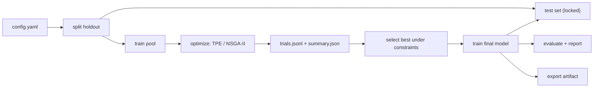
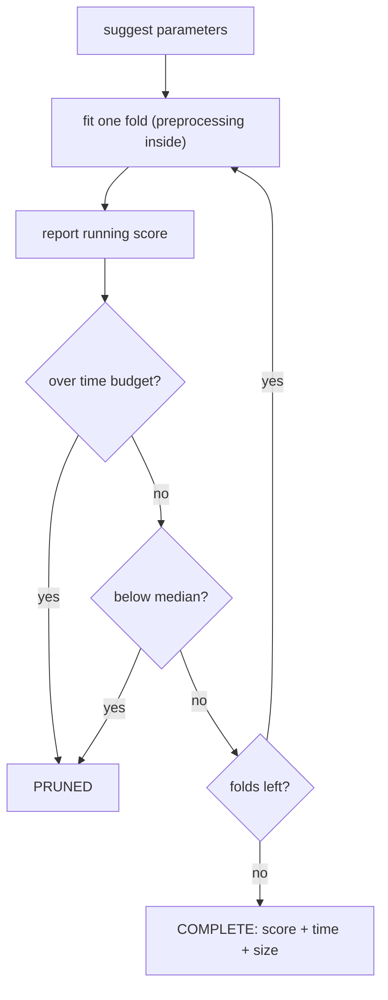

# AutoTuneML


Automated hyperparameter search for scikit-learn models that treats compute as a
budget, records every trial in a plain-text experiment format, and keeps the test
set completely outside the optimization loop.

AutoTuneML is a local, configuration-driven tool. You describe a dataset, a model,
a search space and the trade-offs you care about in a YAML file; the CLI runs the
search, keeps a baseline for reference, selects a final configuration under your
constraints, fits it once, and scores it on a holdout that was set aside before
anything was tuned.



## Contents

- [Features](#features)
- [Installation](#installation)
- [Quickstart](#quickstart)
- [Configuration](#configuration)
- [Supported models and metrics](#supported-models-and-metrics)
- [The optimization strategy](#the-optimization-strategy)
- [Hardware and GPUs](#hardware-and-gpus)
- [Worked example](#worked-example)
- [Why the test set must not take part in hyperparameter selection](#why-the-test-set-must-not-take-part-in-hyperparameter-selection)
- [Experiment storage format](#experiment-storage-format)
- [CLI reference](#cli-reference)
- [Reproducibility](#reproducibility)
- [Development](#development)
- [Project structure](#project-structure)
- [Troubleshooting](#troubleshooting)
- [Extending](#extending)
- [License](#license)

## Features

- **Dataset pipeline** — CSV/Parquet files or bundled scikit-learn datasets, with a
  stratified holdout split that is created once and saved to disk.
- **Fold-local preprocessing** — imputation, scaling and one-hot encoding are fitted
  inside each cross-validation fold, so no validation row ever influences its own
  features.
- **Baseline** — every search starts by cross-validating a fixed default
  configuration, and the summary reports the improvement over it.
- **Hyperparameter search** — Optuna with TPE for single-objective studies and
  NSGA-II for multi-objective studies, driven by the `search.params` section.
- **Pruning** — bad trials are cut off after a few folds (median pruner) or as soon
  as they exhaust a per-trial time budget.
- **Early stopping** — supported where the estimator supports it
  (`hist_gradient_boosting` internally, `xgboost` / `lightgbm` through an inner
  validation split carved out of the training rows only).
- **Resource-aware optimization** — training time and model size are tracked for
  every trial and can be used as objectives or as hard constraints.
- **Experiment tracking** — append-only `trials.jsonl`, frozen `config.yaml`,
  `meta.json` with library versions and hardware, and a `summary.json` with the
  selection result.
- **Markdown reports** — `autotuneml report` turns an experiment into a readable
  `report.md`: baseline vs selected, test metrics, per-class scores, confusion
  matrix, Pareto front and cost plots.
- **Hardware awareness** — CPU/GPU detection is recorded per experiment, and
  `model.device` (`auto`/`cpu`/`cuda`) routes `xgboost`/`lightgbm` to the GPU
  when one is present.
- **Local only** — no service, no database, no frontend. Files on disk.

## Installation

```bash
python -m venv .venv && source .venv/bin/activate
pip install -e .

# optional gradient boosting backends
pip install -e ".[boost]"

# optional report plots (matplotlib)
pip install -e ".[report]"

# test suite
pip install -e ".[dev]"
pytest
```

Requires Python 3.10+.

## Quickstart

```bash
autotuneml optimize --config configs/breast_cancer_rf.yaml --trials 30
autotuneml train     --config configs/breast_cancer_rf.yaml --from-experiment breast_cancer_rf
autotuneml evaluate  breast_cancer_rf
autotuneml report    breast_cancer_rf
autotuneml compare
autotuneml export    breast_cancer_rf
```

Or run the whole sequence with `scripts/run_demo.sh`. A short search looks like
this:

```
$ autotuneml optimize --config configs/breast_cancer_rf.yaml --trials 6
experiment : breast_cancer_rf
model      : random_forest (classification)
metric     : accuracy (maximize)
trials     : 6 (complete=5, pruned=1)
baseline   : 0.9604 in 0.24s (270.5 KB)
best       : 0.9648 in 0.69s (938.2 KB) trial=1
gain       : +0.0044 over baseline
params     : max_depth=17, max_features=log2, min_samples_leaf=2, n_estimators=369, n_jobs=-1
constraints: satisfied
pareto     : 1 non-dominated trial(s)
storage    : experiments/breast_cancer_rf
```

What happens, in order:

| command | reads test rows? | writes |
|---------|------------------|--------|
| `optimize` | no | `trials.jsonl`, `summary.json`, `meta.json`, `holdout/` |
| `train` | yes, once, after parameters are frozen | `model.joblib`, `train_report.json` |
| `evaluate` | yes, re-scores an already trained model | `eval_report.json` |
| `report` | yes, scores the frozen model for the confusion matrix; cannot change parameters | `report.md` (+ plots) |
| `compare` | no | prints a table over `summary.json` files |
| `export` | no | `artifacts/<name>/model.joblib`, `metadata.json` |

`train` also accepts a plain configuration, in which case it fits `model.params`
(or the model defaults) with no search involved.

## Configuration

```yaml
name: breast_cancer_rf
seed: 7
task: classification          # classification | regression
metric: accuracy              # optimisation metric, also the reported score

data:
  source: sklearn:breast_cancer   # or a path to a .csv / .parquet file
  target: target                  # target column, inferred for sklearn datasets
  test_size: 0.2                  # fraction held back before any tuning
  impute: median                  # numeric imputation strategy
  scale: true                     # standard scaling for numeric columns

model:
  name: random_forest
  device: auto                    # auto | cpu | cuda; applies to xgboost/lightgbm
  params:                         # fixed parameters, used by `train` and baseline
    n_jobs: -1

search:
  n_trials: 40
  timeout_seconds: 600            # wall-clock cap for the whole search
  trial_time_budget: 30           # cap for a single trial before it is pruned
  cv_folds: 5
  objectives: [val_score]         # any of val_score, train_time, model_size
  sampler: auto                   # auto | tpe | random | nsga2
  pruner: median                  # median | none
  early_stopping: true
  params:                         # search space
    n_estimators: [100, 600]      # two numbers -> continuous range
    max_depth: [3, 30]
    max_features: ["sqrt", "log2"]  # any other list -> discrete choices
    n_jobs: -1                    # non-list values are held fixed

constraints:                      # optional, applied at selection time
  train_time: { max: 20.0 }
  model_size: { max: 5000000 }

selection:
  weights:                        # only used with multiple objectives
    val_score: 1.0
    train_time: 0.3
    model_size: 0.2
  require_constraints: true       # false = report feasibility but ignore it
```

Search-space syntax: a list of exactly two numbers is a closed range (integers stay
integers), every other list is a set of discrete choices, and anything that is not a
list is a fixed parameter. The search space starts from the built-in defaults for the
selected model and `search.params` overrides them, so a minimal configuration is
usually enough:

```yaml
name: wine_quick
task: classification
data: { source: sklearn:wine }
model: { name: hist_gradient_boosting }
```

Everything else — seed, metric, folds, objectives, constraints — falls back to
sensible defaults (`accuracy`, 5 folds, `["val_score"]`, no constraints).

Each bundled configuration demonstrates a different mode:

- `configs/breast_cancer_rf.yaml` — single objective, TPE, median pruning.
- `configs/wine_hgb.yaml` — three objectives with time and size constraints.
- `configs/diabetes_hgb.yaml` — regression with a minimizing metric (`rmse`).
- `configs/digits_hgb.yaml` — the postal digit-reader example, three objectives
  with edge-device constraints.

## Supported models and metrics

Models: `logistic_regression` (classification only), `random_forest`,
`hist_gradient_boosting`, plus `xgboost` and `lightgbm` when installed
(`pip install -e ".[boost]"`).

Metrics for classification: `accuracy`, `balanced_accuracy`, `f1`, `roc_auc`,
`log_loss`. For regression: `rmse`, `mae`, `r2`. The default is `accuracy` for
classification and `rmse` for regression. Search objectives are always chosen
from `val_score`, `train_time` and `model_size`.

| model | tasks | early stopping | GPU via `device` |
|---|---|---|---|
| `logistic_regression` | classification | — | CPU only |
| `random_forest` | classification, regression | — | CPU only |
| `hist_gradient_boosting` | classification, regression | built in | CPU only |
| `xgboost` (optional) | classification, regression | inner eval split | `cuda` / `cpu` |
| `lightgbm` (optional) | classification, regression | inner eval split | `gpu` / `cpu` |

## The optimization strategy

**1. Split first, tune second.** `optimize` creates the train/test split before the
first trial runs and writes both halves to `experiments/<name>/holdout/`. The search
code receives only the training half. Nothing in the search path can reach the test
file.

**2. Score configurations with cross-validation inside the training half.** Each
trial runs `cv_folds` folds. The preprocessor is re-fitted per fold on the fold's
training rows, so imputation statistics, means, standard deviations and one-hot
vocabularies are always computed from data the fold has not seen. The trial's
`val_score` is the mean fold score; `train_time` is the summed fitting time across
folds; `model_size` is the serialized size of the fitted preprocessor plus estimator.

**3. Cut off hopeless or expensive trials early.**
- The **median pruner** reports the running fold score to Optuna after every fold.
  Once there are enough finished trials, a trial whose running score is below the
  median is stopped instead of finishing its remaining folds.
- The **per-trial time budget** (`search.trial_time_budget`) aborts a trial that has
  already spent its allowance, regardless of how well it is doing. This keeps a
  single large configuration from consuming the whole search budget.
- Pruned trials keep the partial metrics they had reached, so they remain visible in
  `trials.jsonl` with `status: PRUNED`.

**4. Stop fitting when the estimator says so.** For gradient boosting, early
stopping carves a small inner validation split out of the current training fold.
That inner split never contributes to the reported score, so early stopping cannot
inflate the metric.

**5. Search with the right sampler.** With one objective the study uses TPE (or
random sampling if configured). With several objectives it switches to NSGA-II,
which maintains a population and converges toward a Pareto front instead of a single
point.

**6. Select under constraints.** After the search:

- trials that are not `COMPLETE` are discarded;
- trials violating `constraints` are filtered out (if `require_constraints` is true);
- a single objective is selected by plain best-score;
- multiple objectives are selected by a weighted sum of min-max normalized
  objectives, using `selection.weights`.

The summary records the whole non-dominated front, whether the selected trial
satisfies the constraints, and the signed improvement over the baseline. If no trial
satisfies the constraints, selection falls back to the best unconstrained trial and
flags `selected_without_constraints: true` rather than failing silently.

**7. Fit once, then look at the test set.** The winning parameter set is refitted on
all training rows (`train`), and only then is the test split read for a final report.

One trial's life, step by step:



## Hardware and GPUs

Every experiment records its hardware in `meta.json`: CPU count, architecture,
memory, detected GPUs and the accelerator that was actually used. Detection
checks `torch.cuda` first and falls back to `nvidia-smi`, and works without
either installed.

`model.device` controls where gradient boosting trains:

- `auto` (default) uses CUDA when a GPU is present, otherwise the CPU;
- `cpu` always trains on the CPU;
- `cuda` fails fast with a clear error when no GPU is detected, instead of
  silently training on the CPU.

This only applies to `xgboost` and `lightgbm`. The scikit-learn estimators —
including `hist_gradient_boosting` — are CPU-only by design, so requesting
`cuda` for them is rejected at build time. On Apple Silicon the GPU is noted as
present but CUDA-only backends cannot use it; that is reported, not hidden.

A real `hardware` block from a `meta.json`, recorded on a CPU-only workstation:

```json
"hardware": {
  "cpu": {"count": 10, "arch": "arm64", "system": "Darwin", "memory_gb": 16.0},
  "gpu": {"present": false, "devices": [],
          "note": "Apple Silicon GPU is only reachable through torch MPS, not CUDA"},
  "accelerator": "cpu"
}
```

## Worked example

[`examples/digits_postal/`](examples/digits_postal/) tunes a handwritten digit
classifier for a postal sorting prototype under a 5 MB model limit and a 30 s
training budget, end to end: 30 trials, a selected configuration (0.9715 CV
accuracy, 1.23 MB), a final test score of 0.9694 on 360 held-out rows, and the
generated [`report.md`](examples/digits_postal/report.md) with per-class scores,
confusion matrix and cost plots.

The search history and the cost trade-off from that run (Pareto front in red):


Baseline vs selected, copied from the generated report:

|  | trial | accuracy | train time (s) | model size (bytes) |
|---|---|---|---|---|
| baseline | - | 0.9701 | 8.3182 | 2428122 |
| selected | 3 | 0.9715 | 3.8239 | 1289754 |

Final scores on the 360 held-out rows, read exactly once:

| metric | value |
|---|---|
| accuracy | 0.9694 |
| balanced_accuracy | 0.9696 |
| f1 | 0.9694 |
| roc_auc | 0.9997 |
| log_loss | 0.0680 |

## Why the test set must not take part in hyperparameter selection

The test set exists to answer one question: *how will the finished system behave on
data it has never seen?* Every configuration you try is a question about the data.
If the answers from the test set influence which configuration you pick, the test
set stops being independent evidence and becomes part of the training signal.

The failure is easy to miss because the numbers still look plausible. A search over
40 configurations will find one that happens to be lucky on any fixed holdout, and
the reported score then estimates the best configuration's *agreement with that
holdout* rather than its generalization error. With enough trials the optimism grows
with them — the effective number of evaluations against a reused holdout is the
number of trials, not the number of final reports. This is the same adaptive
overfitting problem that makes repeated manual tuning against a fixed validation
split unreliable, only less visible.

AutoTuneML keeps the separation structural instead of relying on discipline:

- the holdout is created before the first trial and written to its own directory;
- `Objective` is constructed from `X_train` / `y_train` only, and a test in
  `tests/test_objective.py` asserts that no test row index ever reaches it;
- the search reads and writes `trials.jsonl`, `summary.json` and the holdout's
  *training* half, never the test half;
- test rows are read in exactly three commands — `train`, `evaluate` and
  `report` — all of which run after the parameter set is frozen. `evaluate`
  simply re-scores an already trained model and `report` scores it once more for
  the confusion matrix; neither can influence it;
- configuration, seed, library versions and a config hash are recorded so a run can
  be reproduced and audited later.

Validation scores still guide the search, which is their job. The test set is read
once, at the end, and reported as a fact about a model that no longer changes.

## Experiment storage format

```
experiments/<name>/
  config.yaml          frozen copy of the resolved configuration
  meta.json            seed, creation time, config hash, library versions, hardware
  holdout/
    train.csv          rows available to the search (row_id index preserved)
    test.csv           rows reserved for the final report
  trials.jsonl         one JSON record per trial, appended as trials finish
  summary.json         selection outcome, baseline, pareto front, state counts
  model.joblib         written by `train`
  train_report.json    cv metrics + test metrics of the trained model
  eval_report.json     written by `evaluate`
  report.md            written by `report`, with history.png / tradeoff.png plots
artifacts/<name>/
  model.joblib         exported copy of the trained model
  metadata.json        parameters, cv/test metrics, provenance
```

A real trial record (from a 6-trial run on breast cancer):

```json
{
  "trial": 0,
  "status": "COMPLETE",
  "params": {"n_jobs": -1, "n_estimators": 138, "max_depth": 24,
             "min_samples_leaf": 9, "max_features": "log2"},
  "val_score": 0.9516,
  "train_time": 0.3047,
  "model_size": 227227,
  "duration": 0.3901,
  "fitted_rounds": null,
  "error": null,
  "finished_at": "2026-10-09T10:50:59"
}
```

`status` is `COMPLETE`, `PRUNED` or `FAIL`. Failed trials carry the exception in
`error` and keep their parameters, so a broken region of the search space is visible
instead of disappearing. Trials with no fitted rounds (trees without early stopping)
report `fitted_rounds: null`.

`trials.jsonl` is append-only: if a search is interrupted, every finished trial is
already on disk, so no completed work is lost.

`summary.json` closes the search (excerpt from a real 4-trial run):

```json
{
  "n_trials": 4,
  "states": {"COMPLETE": 4},
  "baseline": {"val_score": 0.9604395604395606, "train_time": 0.2453, "model_size": 277003},
  "best": {"trial": 1, "val_score": 0.9648351648351647, "train_time": 0.6926,
           "model_size": 960667, "constraints_satisfied": true,
           "params": {"n_estimators": 369, "max_depth": 17, "min_samples_leaf": 2,
                      "max_features": "log2", "n_jobs": -1}},
  "improvement_over_baseline": 0.004395604395604158,
  "selection": {"rule": "single_objective", "require_constraints": true}
}
```

## CLI reference

```
autotuneml optimize --config CONFIG [--name NAME] [--trials N] [--timeout S]
                    [--root DIR] [--overwrite]

autotuneml train    --config CONFIG [--name NAME] [--from-experiment NAME] [--root DIR]

autotuneml evaluate EXPERIMENT [--root DIR]

autotuneml compare  [EXPERIMENT ...] [--root DIR]

autotuneml report    EXPERIMENT [--root DIR] [--out DIR]

autotuneml export   EXPERIMENT [--root DIR] [--out DIR]
```

- `--name` overrides the experiment name from the configuration, which lets one
  configuration file back several experiments.
- `--from-experiment` reuses the selected parameters of a previous search instead of
  `model.params` — the normal flow is `optimize` then `train --from-experiment`.
- `--root` points at an alternative storage directory (used by the tests).

## Reproducibility

Every experiment stores `seed`, the fully resolved configuration, a configuration
hash, the hardware it ran on, and the versions of Python, numpy, pandas,
scikit-learn, optuna and joblib.
Splits, folds, samplers and estimators all derive from `seed`, so re-running a
configuration with the same environment reproduces the same search.

## Development

```bash
pytest                # configuration, objective, persistence, selection, hardware, report, CLI
```

The test suite runs on small datasets and finishes in a few seconds:

| test file | covers | tests |
|---|---|---|
| `test_config.py` | configuration loading and validation | 21 |
| `test_objective.py` | objective values, pruning, failover, test-set isolation | 9 |
| `test_persistence.py` | experiment storage format | 12 |
| `test_selection.py` | Pareto front, constraints, weighted selection | 16 |
| `test_hardware.py` | GPU detection parsing, device resolution | 10 |
| `test_models.py` | search spaces, model builders, early stopping | 18 |
| `test_report.py` | report generation, with and without a trained model | 6 |
| `test_cli.py` | end-to-end runs of all six commands | 7 |

Coverage of interest: `tests/test_objective.py` proves that test rows never reach the objective,
and `tests/test_selection.py` covers the constraint and Pareto logic used to pick the
final trial.

## Project structure

```
AutoTuneML/
├── README.md / LICENSE / pyproject.toml
├── configs/            breast_cancer_rf, wine_hgb, diabetes_hgb, digits_hgb
├── scripts/            run_demo.sh — the full workflow on breast cancer
├── examples/           digits_postal — worked example with a real report
├── experiments/        one folder per run (content is git-ignored)
├── artifacts/          exported models (content is git-ignored)
├── src/autotuneml/
│   ├── cli.py          argparse entry point, six subcommands
│   ├── config.py       YAML loading, validation, typed ExperimentConfig
│   ├── data.py         dataset loading, holdout split, fold-local preprocessing
│   ├── evaluate.py     one-shot scoring on the held-out test split
│   ├── compare.py      summary collection and text table
│   ├── export.py       model copy plus metadata.json into artifacts/
│   ├── hardware.py     CPU/GPU detection and device resolution
│   ├── metrics.py      metric registry, directions, report computation
│   ├── models.py       estimator registry, search spaces, early-stopping fits
│   ├── objective.py    Optuna objective, fold loop, pruning hooks
│   ├── report.py       report data, markdown rendering, plots
│   ├── runner.py       optimize/train orchestration, baseline, selection
│   ├── selection.py    feasibility, Pareto front, weighted selection
│   └── tracking.py     experiment directory, trials.jsonl, summaries
└── tests/              pytest suite, small datasets, a few seconds
```

## Troubleshooting

- `experiment 'X' already exists ...` — the name is taken. Pass `--overwrite`
  to replace it or `--name` to start a new experiment.
- `device 'cuda' was requested but no GPU was detected` — use `device: auto`
  or `device: cpu`, or run on a machine with a CUDA GPU.
- `xgboost/lightgbm ... cannot be imported` — install them with
  `pip install -e ".[boost]"`. On macOS they additionally need an OpenMP
  runtime (`brew install libomp`); without it the import fails even though the
  package is installed.
- `has no summary.json; run optimize first` — the commands run in order:
  `optimize`, then `train`, then `evaluate` / `report`.
- `has no model.joblib; run train first` — `evaluate` needs a trained model.
  `report` works without one but marks the test section as pending.
- `unknown parameters for <model>` — a typo in `model.params` or a fixed
  `search.params` entry. This is caught when the config loads, not mid-search.

## Extending

- **Metric** — add it to `METRIC_DIRECTIONS` and `compute` in
  `src/autotuneml/metrics.py`.
- **Model** — register defaults and a search space in `src/autotuneml/models.py`, add
  the estimator to `_sklearn_model` (and to `MODEL_NAMES`).
- **Dataset** — any CSV with a target column works; bundled scikit-learn datasets
  are listed in `SKLEARN_SOURCES` in `src/autotuneml/data.py`.
- **Report section** — `build_report_data` and `render_markdown` in
  `src/autotuneml/report.py` define what a report contains.

## License

MIT — see [LICENSE](LICENSE).
