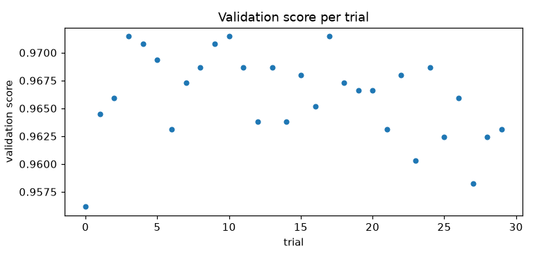
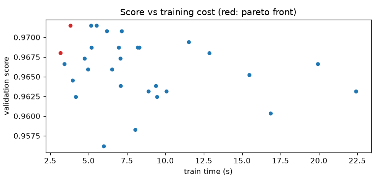

# Experiment report: digits_postal

Generated 2026-10-09T06:51:39+00:00 by `autotuneml report`.

## Setup

| model | task | metric | direction | seed | trials | train rows | test rows |
|---|---|---|---|---|---|---|---|
| hist_gradient_boosting | classification | accuracy | maximize | 21 | 30 | 1437 | 360 |

## Baseline vs selected

|  | trial | accuracy | train time (s) | model size (bytes) |
|---|---|---|---|---|
| baseline | - | 0.9701 | 8.3182 | 2428122 |
| selected | 3 | 0.9715 | 3.8239 | 1289754 |

Improvement over baseline: 0.0014.

## Selection

Rule: `weighted_sum`. Weights: `{'val_score': 1.0, 'train_time': 0.3, 'model_size': 0.2}`. Constraints: `{'train_time': {'max': 30.0}, 'model_size': {'max': 5000000.0}}`.
Constraints satisfied: True.
Best parameters: `{'max_iter': 353, 'learning_rate': 0.232504273943392, 'max_leaf_nodes': 124, 'min_samples_leaf': 47, 'l2_regularization': 0.3842500320901294}`.

## Trials

States: COMPLETE=30.

### Top trials

| trial | accuracy | train time (s) | model size (bytes) | params |
|---|---|---|---|---|
| 3 | 0.9715 | 3.8239 | 1289754 | {'max_iter': 353, 'learning_rate': 0.232504273943392, 'max_leaf_nodes': 124, 'min_samples_leaf': 47, 'l2_regularization': 0.3842500320901294} |
| 10 | 0.9715 | 5.5281 | 2240634 | {'max_iter': 295, 'learning_rate': 0.14722928613100988, 'max_leaf_nodes': 49, 'min_samples_leaf': 50, 'l2_regularization': 0.13966465542401996} |
| 17 | 0.9715 | 5.1655 | 1747954 | {'max_iter': 229, 'learning_rate': 0.16814164644798252, 'max_leaf_nodes': 74, 'min_samples_leaf': 57, 'l2_regularization': 0.2465759340069429} |
| 4 | 0.9708 | 6.1972 | 1914162 | {'max_iter': 193, 'learning_rate': 0.21974091980765403, 'max_leaf_nodes': 45, 'min_samples_leaf': 52, 'l2_regularization': 0.9131639696118056} |
| 9 | 0.9708 | 7.1649 | 2241866 | {'max_iter': 222, 'learning_rate': 0.2519290770205589, 'max_leaf_nodes': 112, 'min_samples_leaf': 48, 'l2_regularization': 0.887655437207203} |
| 5 | 0.9694 | 11.5345 | 3966786 | {'max_iter': 317, 'learning_rate': 0.1646671905722585, 'max_leaf_nodes': 33, 'min_samples_leaf': 20, 'l2_regularization': 0.28394304503063383} |
| 24 | 0.9687 | 8.2082 | 2075890 | {'max_iter': 203, 'learning_rate': 0.12172664751400908, 'max_leaf_nodes': 47, 'min_samples_leaf': 47, 'l2_regularization': 0.7158187356220659} |
| 11 | 0.9687 | 6.9753 | 1884586 | {'max_iter': 190, 'learning_rate': 0.08473944818329399, 'max_leaf_nodes': 81, 'min_samples_leaf': 54, 'l2_regularization': 0.3277415904125234} |
| 8 | 0.9687 | 8.3147 | 2033106 | {'max_iter': 185, 'learning_rate': 0.13489917000038923, 'max_leaf_nodes': 106, 'min_samples_leaf': 37, 'l2_regularization': 0.8983403385846943} |
| 13 | 0.9687 | 5.1962 | 1334562 | {'max_iter': 214, 'learning_rate': 0.226950443555545, 'max_leaf_nodes': 67, 'min_samples_leaf': 53, 'l2_regularization': 0.7021642920041132} |

### Pareto front

| trial | val_score | train_time | model_size |
|---|---|---|---|
| 3 | 0.9715 | 3.8239 | 1,289,754 |
| 15 | 0.9680 | 3.1753 | 643,626 |

## Test set

| metric | value |
|---|---|
| accuracy | 0.9694 |
| balanced_accuracy | 0.9696 |
| f1 | 0.9694 |
| roc_auc | 0.9997 |
| log_loss | 0.0680 |

### Per-class scores

| class | precision | recall | f1 | support |
|---|---|---|---|---|
| 0 | 1.0 | 1.0 | 1.0 | 36 |
| 1 | 0.9231 | 1.0 | 0.96 | 36 |
| 2 | 1.0 | 1.0 | 1.0 | 35 |
| 3 | 1.0 | 0.9189 | 0.9577 | 37 |
| 4 | 0.9714 | 0.9444 | 0.9577 | 36 |
| 5 | 0.9722 | 0.9459 | 0.9589 | 37 |
| 6 | 0.9722 | 0.9722 | 0.9722 | 36 |
| 7 | 0.9474 | 1.0 | 0.973 | 36 |
| 8 | 0.9697 | 0.9143 | 0.9412 | 35 |
| 9 | 0.9474 | 1.0 | 0.973 | 36 |

### Confusion matrix

Rows are true labels, columns are predicted labels.

| true \ pred | 0 | 1 | 2 | 3 | 4 | 5 | 6 | 7 | 8 | 9 |
|---|---|---|---|---|---|---|---|---|---|---|
| 0 | 36 | 0 | 0 | 0 | 0 | 0 | 0 | 0 | 0 | 0 |
| 1 | 0 | 36 | 0 | 0 | 0 | 0 | 0 | 0 | 0 | 0 |
| 2 | 0 | 0 | 35 | 0 | 0 | 0 | 0 | 0 | 0 | 0 |
| 3 | 0 | 0 | 0 | 34 | 0 | 0 | 0 | 1 | 1 | 1 |
| 4 | 0 | 0 | 0 | 0 | 34 | 0 | 0 | 1 | 0 | 1 |
| 5 | 0 | 0 | 0 | 0 | 1 | 35 | 1 | 0 | 0 | 0 |
| 6 | 0 | 1 | 0 | 0 | 0 | 0 | 35 | 0 | 0 | 0 |
| 7 | 0 | 0 | 0 | 0 | 0 | 0 | 0 | 36 | 0 | 0 |
| 8 | 0 | 2 | 0 | 0 | 0 | 1 | 0 | 0 | 32 | 0 |
| 9 | 0 | 0 | 0 | 0 | 0 | 0 | 0 | 0 | 0 | 36 |

## Hardware

| cpu | arch | memory (GB) | gpu present | gpu devices | accelerator |
|---|---|---|---|---|---|
| 10 | arm64 | 16.0 | False | - | cpu |

## Versions

| package | version |
|---|---|
| python | 3.14.7 |
| numpy | 2.5.2 |
| pandas | 3.0.5 |
| sklearn | 1.9.0 |
| optuna | 5.0.0 |
| joblib | 1.5.3 |
